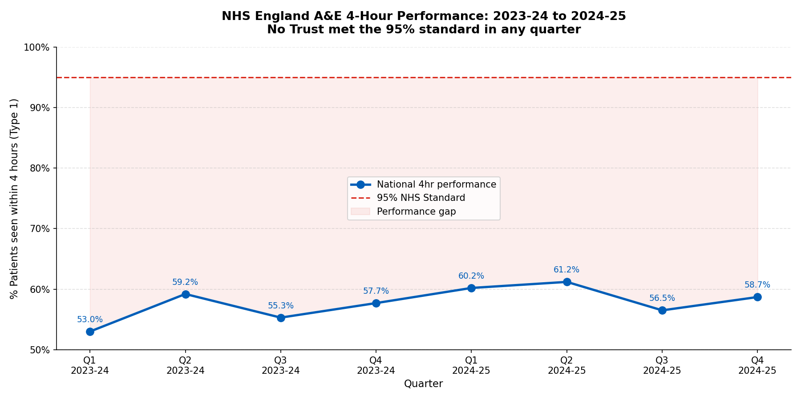
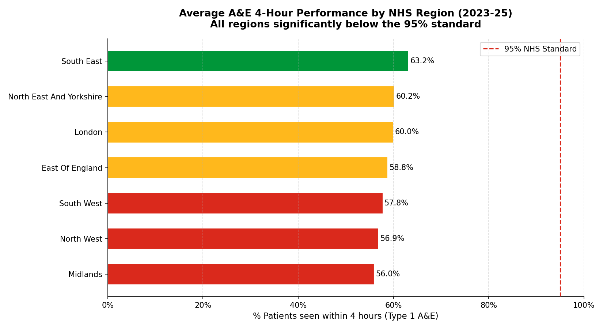
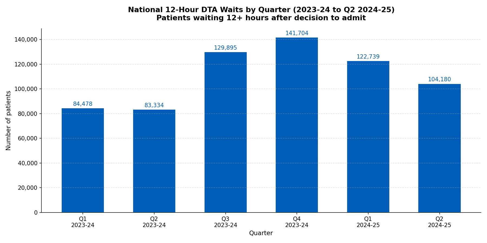

# NHS A&E Performance Analysis (2023-25)

## Project Overview
An end-to-end data analysis project examining NHS England Accident & Emergency 
performance across 120+ NHS Trusts over two financial years (2023-24 and 2024-25).

Built to demonstrate the full analyst workflow: data pipeline, SQL analysis, 
Python visualisation, and Power BI dashboard - using real, publicly available 
NHS England data.

---

## Key abbrevation and its meaning
A&E - Accident and Emergency. The hospital department where people go for urgent medical treatment. Also called an Emergency Department (ED).
DTA - Decision To Admit. The moment a doctor decides a patient needs a hospital bed. The 12-hour DTA wait measures how long patients are stuck in A&E after that decision because no bed is available.
ICB - Integrated Care Board. The regional NHS organisation responsible for planning and commissioning health services for a local area. Replaced Clinical Commissioning Groups (CCGs) in 2022.
RAG - Red, Amber, Green. A traffic light system used in NHS reporting to show whether performance is on track (Green), at risk (Amber) or failing (Red).
MSitAE - Monthly Situation Report for A&E. The official name of the NHS England data collection that your dataset comes from.
SDCS - Strategic Data Collection Service. The NHS system used by Trusts to submit performance data to NHS England.
OGL - Open Government Licence. The licence under which NHS England publishes its open data, allowing free use with attribution.

## Key Findings

- **No NHS Trust met the 95% four-hour standard** in any quarter across the 
  entire two-year period
- National Type 1 A&E performance ranged between **53% and 66%** across 8 quarters,  
  against a 95% target
- **12-hour DTA waits peaked at 142,000 in Q4 2023-24**, indicating severe 
  bed capacity pressure beyond the A&E department itself
- Performance follows a consistent **seasonal pattern** - dipping every Q3 
  (Oct-Dec) due to winter demand
- The **Midlands and North West** regions show the most systemic pressure, 
  with average performance below 57%
- **24 of the top 30 highest-volume Trusts** show worsening 12 hour wait trends 
  year on year

  ## Charts

---

## Tools & Technologies

| Layer | Tool | Purpose |
|---|---|---|
| Data Pipeline | Python (Pandas, SQLAlchemy) | Extract, clean and load 8 quarterly NHS files |
| Database | SQL Server (SSMS) | Staging, transformation and analytical queries |
| Analysis | SQL (CTEs, Window Functions) | Trust ranking, trend analysis, benchmarking |
| Visualisation | Python (Matplotlib, Seaborn) | Exploratory charts and documentation visuals |
| Dashboard | Power BI (DAX, Star Schema) | Interactive 3-page executive dashboard |

---

## Dataset

**Source:** NHS England - Monthly A&E Attendances and Emergency Admissions  
**URL:** https://www.england.nhs.uk/statistics/statistical-work-areas/ae-waiting-times-and-activity/  
**Coverage:** Q1 2023-24 to Q4 2024-25 (8 quarters)  
**Providers:** 120+ NHS Trusts and Foundation Trusts  
**Rows:** 1,600+ provider-quarter records  
**Licence:** Open Government Licence v3.0

---

## Project Structure